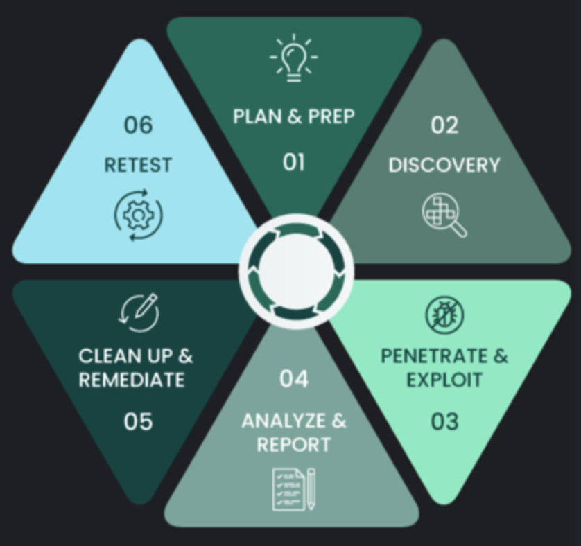
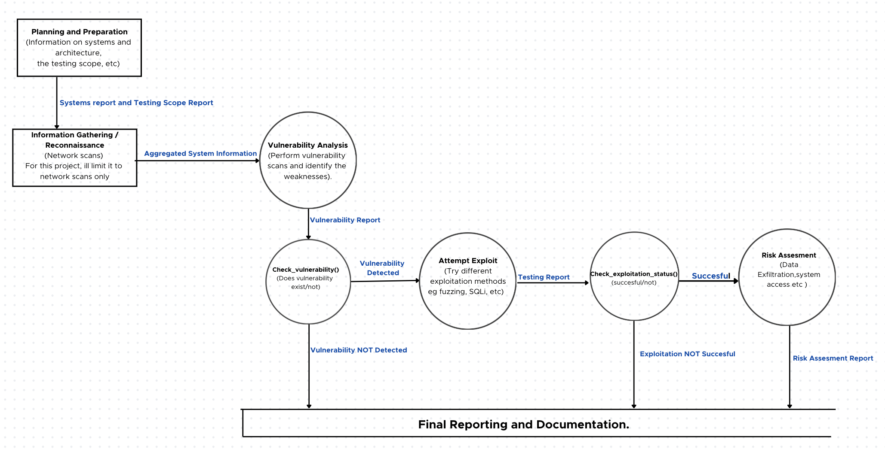

# Penetration Testing Project

  
This repository contains the methodology, reports, and references used for conducting a network-focused penetration test. The objective is to identify, exploit, and assess vulnerabilities within the defined scope, and to provide insights on improving overall security posture.

## Data Flow Diagram

## Methodology Overview

1. **Planning & Preparation:**  
   Gather information on the target systems and define the testing scope and objectives.

2. **Information Gathering / Reconnaissance:**  
   Perform network scans and service enumeration to aggregate system information. For this project, efforts are limited to network-based reconnaissance (e.g., Nmap scanning).

3. **Vulnerability Analysis:**  
   Utilize vulnerability scanning tools and manual techniques to identify potential weaknesses.

4. **Vulnerability Verification:**  
   Check if identified vulnerabilities are valid

5. **Attempt Exploitation:**  
   Leverage various methods (fuzzing, SQL injection attempts, etc.) to exploit confirmed vulnerabilities and test the impact of successful compromises.

6. **Risk Assessment:**  
   Evaluate the overall risk associated with successful exploits, such as data exfiltration possibilities or unauthorized system access.

7. **Reporting & Documentation:**  
   Produce reports detailing findings, exploitation steps, and recommended remediation strategies.

## Documentation

For a comprehensive, step-by-step guide and detailed documentation of all tools, tests, and results, please visit:  
[External Documentation Link](https://abbynyakara.github.io/CMSE_890_602_Project/)

## Disclaimer

There is no actual network scanning/ information gathering done for this project. The data created and used was dummy data.

## Snakemake
Some of the challenges I had with using snakemake are documented here: 
[External Link](https://github.com/AbbyNyakara/CMSE_890_602_Project/blob/dev/workflow/SnakeMake%20Report.pdf)
