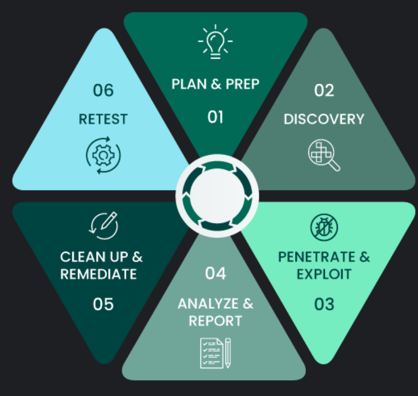

# Penetration Testing Sample Workflow Documentation

!!! Abstract "Penetration Testing - Information"

    Penetration testing, or "pen testing," is a security check where experts mimic real cyberattacks to spot vulnerabilities in systems,
    networks, or applications. It’s a way to test how well existing security measures hold up, uncover potential weaknesses 
    that hackers might exploit, and offer suggestions to strengthen defenses. Pen testing can involve manual methods, automated tools, or a mix of both, making it an essential step for staying ahead in cybersecurity.

!!! Tip "Project Limits"

    The penetration testing process typically involves detailed discussions and clearly defined boundaries 
    before gaining authorization to access any systems. In this project, no real systems were accessed or scanned. 
    All data utilized is entirely simulated, ensuring that no actual networks were involved in the testing.

    This code is to serve as an example workflow of how a pentest process will be done
    - The actual implementation varies across different companies and situations
    